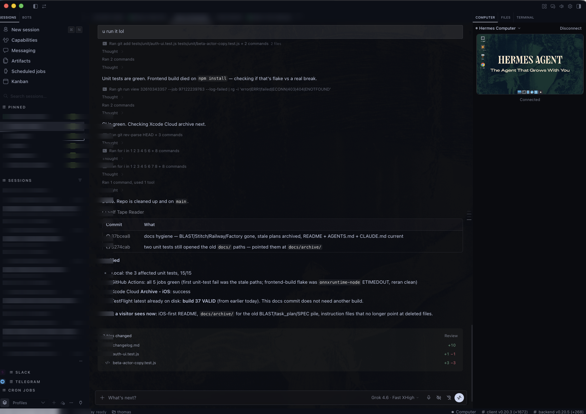
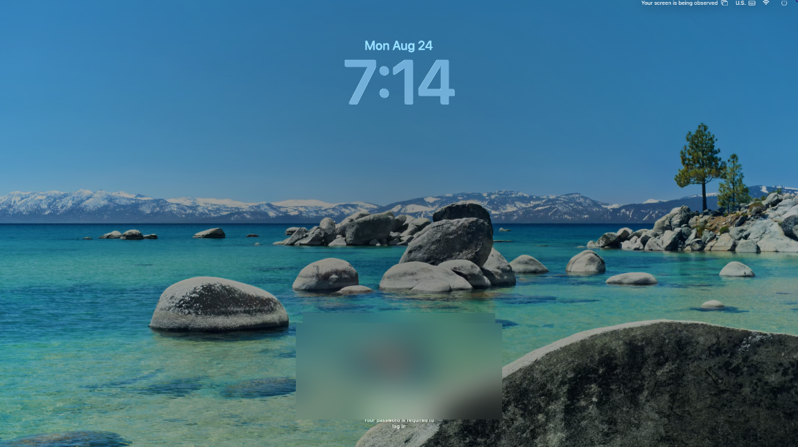

# Computer — live desktop viewer for Hermes Desktop

A Hermes Desktop plugin that docks a live remote-desktop thumbnail on the
right. Click to expand fullscreen. One connection serves both sizes;
expand/collapse never reconnects.

**The pitch:** your bots live in Hermes. Now their computers do too — cloud
boxes, spare Macs, Windows PCs, Linux machines — switchable from one dropdown,
watchable from one pane, like a KVM switch for your agent fleet.

```
┌──────────────────────────┬──────────────────────┐
│                          │  ▾ Hermes Computer   │
│   Hermes chat            │ ┌──────────────────┐ │
│   (your bots)            │ │  live desktop    │ │
│                          │ │  (thumbnail)     │ │
│                          │ └──────────────────┘ │
│                          │  ● Connected  HD 30  │
│                          │  CRONJOBS / panes    │
└──────────────────────────┴──────────────────────┘
```

<p align="center">
  
</p>
<p align="center"><em>The Computer pane docked in Hermes Desktop — live remote desktop
on the right. Session names in the sidebar and tabs blurred.</em></p>

<p align="center">
  
</p>
<p align="center"><em>A real capture from the plugin's pipeline: a live macOS machine,
viewed through the pane's noVNC connection.</em></p>

## Highlights

- **One pane, every computer.** Cloud (Orgo, TLS-fronted VPS, Docker boxes)
  and LAN machines (Mac / Windows / Linux) in a single switcher. One click to
  jump between them; inactive machines keep a last-frame snapshot.
- **Paste-anything setup.** One address field accepts a websocket URL, a
  noVNC page, a session API, an API key, or a bare `host:port` — it figures
  out the rest and tells you what it found in plain English.
- **One-paste host scripts.** `connect-mac.sh` / `connect-windows.ps1` /
  `connect-linux.sh` turn a spare machine into a computer the plugin can see.
  Idempotent, ASCII-safe, survive reboots.
- **Headless-friendly.** A monitor-less Windows PC gets a signed virtual
  display automatically; a locked Mac is handled gracefully. Built and tested
  on genuinely headless hardware.
- **Optional HD mode.** Hardware-encoded H.264 (VideoToolbox / NVENC) over a
  websocket, decoded in-app via WebCodecs, layered over the always-on VNC
  path. One **HD** toggle; VNC is the silent safety net.
- **Multi-bot aware.** Per-bot computer bindings — each of your profiles can
  have its own machine, and the pane follows the focused chat.
- **Bots with hands, not just eyes.** The optional `orgo-computer` agent
  plugin lets your bots run shell commands and delegate GUI tasks on their
  pinned computer. Watch the pane while the bot works inside it.
- **Stays inside the plugin system.** One `plugin.js`, the three allowed
  imports, official contribution points (pane, status bar, palette,
  keybinds). Hot-reloadable, no build step, no core patches.

> **Known issues & war stories:** [docs/KNOWN-ISSUES.md](docs/KNOWN-ISSUES.md)
> — every non-obvious failure we hit on real hardware and what fixed it.
> Design docs live in [`docs/`](docs/).

## Repository layout

```
plugin.js              the entire desktop plugin (single ESM file)
connect-mac.sh         one-paste VNC bridge setup for a Mac
connect-windows.ps1    same for Windows (TightVNC/UltraVNC + websockify + virtual display)
connect-linux.sh       same for Linux (x11vnc / wayvnc + websockify)
hiperf-agent.py        optional HD streaming agent (H.264 over WebSocket)
hiperf-mac.sh          HD agent installer, macOS (VideoToolbox)
hiperf-windows.ps1     HD agent installer, Windows (NVENC / x264)
hiperf-linux.sh        HD agent installer, Linux (VAAPI / x264)
agent-plugin/          orgo-computer: gives bots hands on their computer (shell + GUI tools)
install-agent-plugin.sh  install the agent plugin into one or every Hermes profile
orgo-term              one-shot root shell on an Orgo box (WebSocket PTY, no AI credits)
docs/                  specs, build notes, known issues
NOTICE.md              licensing + attribution (parts adapted from Korgo Bot, MIT)
```

Plugin id: `computer-viewer` (folder name must match).

## Connect any computer

The plugin talks to two kinds of computer:

- **Cloud** — the machine already speaks the plugin's protocol. Paste a
  websocket URL, a noVNC page, a session API URL, or an API key (Orgo, a
  TLS-fronted VPS, a Docker desktop box). Detection is automatic; you do not
  pick a mode.
- **Local** — a Mac, Windows PC, or Linux box on your LAN or Tailscale. Run
  the one-paste script **on that machine**. It binds VNC to localhost and
  publishes a WebSocket on port **6080**. Paste the printed
  `ws://.../websockify` address into **Computer address**, plus the VNC
  password (and on a Mac, your username).

The scripts are idempotent and print the exact paste address when they
finish. Tailscale MagicDNS names and `.local` hostnames both work. websockify
is pinned (`websockify==0.13.0` on Mac/Windows; distro package on Linux).
LAN / Tailscale only — never the public internet.

### macOS

On the Mac you want to view:

1. **System Settings -> General -> Sharing -> enable Screen Sharing** ->
   Screen Sharing **(i)** -> **VNC viewers may control screen with password**
   -> set a password of **at most 8 characters** (classic VNC DES truncates
   longer secrets).
2. In Terminal:

```bash
curl -fsSL https://raw.githubusercontent.com/thomasbek3/hermes-computer-viewer/master/connect-mac.sh | bash
```

3. In the plugin: paste the printed address, your Mac username
   (Advanced -> Username), and that VNC password.

The script does **not** turn Screen Sharing on (kickstart needs sudo and
drops live sessions). It installs pinned websockify in `~/.hermes-cv/venv`
and a LaunchAgent that survives login.

Optional HD stream on the same Mac: after VNC works, run `hiperf-mac.sh`
(see **High-performance mode** below). The Mac must be logged in, and Screen
Recording must be granted by hand.

### Windows (Administrator PowerShell)

```powershell
irm https://raw.githubusercontent.com/thomasbek3/hermes-computer-viewer/master/connect-windows.ps1 | iex
```

Run in **Administrator** PowerShell (the script self-elevates). It installs
TightVNC (loopback-only) + websockify as a SYSTEM scheduled task and prints
the address plus a generated 8-character VNC password. The script is
ASCII-only so `irm ... | iex` works on Windows PowerShell 5.1. Physically
headless PCs (no monitor) get a virtual display + UltraVNC capture fallback;
see **Headless Windows** below.

### Linux (X11; wlroots-Wayland best-effort)

```bash
curl -fsSL https://raw.githubusercontent.com/thomasbek3/hermes-computer-viewer/master/connect-linux.sh | bash
```

X11 uses `x11vnc`. wlroots compositors (Sway, Hyprland, ...) use `wayvnc`
(less battle-tested; noVNC may not speak wayvnc's RSA-AES). **GNOME/KDE
Wayland is not supported** - log into an Xorg session. The script prints the
address and the VNC password it stored.

## Give your bot hands: the agent plugin

The desktop pane gives **you** eyes on the computer. The optional
**orgo-computer agent plugin** gives your **bot** hands on it — so Hermes can
actually drive the machine, not just display it.

With both halves installed, a bot in any chat can:

- `orgo_computer_bash` — run shell commands on the pinned computer (files,
  packages, git — anything that doesn't need a screen)
- `orgo_computer_run` — delegate a bounded GUI/browser task (clicks, typing)
  to Orgo's hosted computer-use agent

Install into one or every Hermes profile:

```bash
bash install-agent-plugin.sh            # all profiles, prompts once for the key
bash install-agent-plugin.sh --profiles default,parker --yes --api-key sk_live_xxx
```

Then pin a computer per profile with `/computer` in that chat. The plugin is
per-profile on purpose: parker's bot can drive one Orgo box while alfred's
drives another. Pair each profile with the same machine in the viewer's
per-bot endpoint and you get the full picture — watch the pane while the bot
works inside it.

> Attribution: parts of this agent plugin are adapted from
> [Korgo Bot](https://github.com/nickvasilescu/korgo-bot) (MIT) — see
> [NOTICE.md](NOTICE.md).

### Costs: bash is free, GUI clicks are not

Orgo meters only one thing: its **hosted computer-use AI** (`orgo_computer_run`),
which burns your plan's AI credits (~1¢/step). Everything else —
`orgo_computer_bash`, screenshots, direct API calls, the WebSocket terminal —
is included in your monthly plan. So:

- **Default to `orgo_computer_bash`.** Opening Chrome to a URL is one command
  (`google-chrome --no-sandbox --disable-gpu URL &`), not eight GUI steps.
- **Reach for `orgo_computer_run` only when eyes are required** — visual
  verification, unfamiliar UI, no CLI path.
- Measured on real hardware: Chrome + news site = 8 GUI steps / ~90s / ~12¢
  vs 1 bash command / ~5s / $0.

### Direct terminal access: `orgo-term`

For humans (and Mac-side agents), `orgo-term` is a one-shot terminal on any
Orgo computer over Orgo's official WebSocket PTY — no SSH needed (Orgo boxes
don't accept inbound SSH by design), no credits burned:

```bash
ORGO_COMPUTER_ID=<your-computer-uuid> ./orgo-term "whoami && hostname"
```

`ORGO_API_KEY` comes from the environment or `~/.hermes/.env`. You can also
drop both values in `~/.hermes-cv/orgo.env` so you don't have to export them
every time. Precedence: already-set environment variables win, then
`~/.hermes-cv/orgo.env`, then `~/.hermes/.env`. Optional: `ORGO_INSTANCE_ID`
if auto-detect from the computer record fails.

Works from macOS or Linux. Needs `websocket-client`
(`python3 -m pip install --user websocket-client`; the script installs it
on first run if missing).

Chrome-on-Orgo tips learned the hard way: launch with `--no-sandbox
--disable-gpu` (root + software rendering), dismiss the first-run sign-in
dialog once via keyboard (`Tab` then `Return`), and always set
`DISPLAY=:99` (Orgo's Xvnc display):

```bash
./orgo-term 'DISPLAY=:99 google-chrome --no-sandbox --disable-gpu --no-first-run https://news.google.com >/tmp/chrome.log 2>&1 &'
```

Architecture note: like Grok Bot, the brain does not live on the computer.
Hermes (the brain) reaches out to the box (the hands) through Orgo's API;
the pane is only the window. Because the pieces are decoupled, the viewer
can run from a different Mac than the gateway doing the driving. And if you
launch your Orgo computer from the **Hermes Agent template**, a full Hermes
brain can live *on* the computer itself — Grok Bot can't do that part.

## High-performance mode (optional)

An optional H.264 overlay on top of the VNC session (port **6090**, path
`/stream`). VNC stays mandatory: it carries mouse/keyboard and is the
fallback. Install the host agent **on the machine you want to view**, after
the `connect-*` script.

macOS:

```bash
curl -fsSL https://raw.githubusercontent.com/thomasbek3/hermes-computer-viewer/master/hiperf-mac.sh | bash
```

`hiperf-mac.sh` looks for ffmpeg at `~/.hermes-cv/bin/ffmpeg` and Python
3.10+ at `~/.hermes-cv/python/bin/python3` before PATH / Homebrew. A static
arm64 ffmpeg or a python-build-standalone tree can be dropped in those
locations when Homebrew is unavailable. The script does not download them.

**How it works, honestly.** The host captures its screen with ffmpeg,
hardware-encodes H.264 (VideoToolbox on macOS, NVENC on Windows, VAAPI where
available, x264 single-slice baseline as the universal fallback), and streams
access units over a token-authed WebSocket. The plugin decodes with WebCodecs
and paints over the VNC view. If HD hiccups, VNC is already showing — you
never see a gap.

**Tuning notes from live hardware** (details in
[docs/KNOWN-ISSUES.md](docs/KNOWN-ISSUES.md)): Electron's VideoDecoder is
particular — encoders are forced to constrained-baseline, single-slice,
yuv420p output, which is what actually decodes. Dark desktops are *not*
capture failures; the client checks contrast, not brightness.

### macOS Screen Recording (TCC)

Live finding on a real Apple-silicon Mac: a launchd-started agent **cannot**
trigger the interactive TCC prompt, and `launchctl asuser` requires root, so
the installer **cannot** obtain permission for you. Missing permission is
**not an error exit** -- ffmpeg capture simply **hangs with no output**. If
the Mac is sitting at the lock screen, capture yields only the lock screen.

- The Mac must be **LOGGED IN** (not at the lock screen) for capture to show
  the desktop.
- Screen Recording must be granted **MANUALLY**: System Settings -> Privacy &
  Security -> Screen Recording -> add/enable **BOTH** the venv python
  (`~/.hermes-cv/hiperf/venv/bin/python`) **and** the ffmpeg binary in use.
- If the machine is headless, grant that through the plugin's own VNC view of
  that Mac (the working VNC path is how you enable the fast path).

Symptoms:

- capture hangs / port 6090 never listens -> almost certainly missing Screen
  Recording permission
- frames arrive but are the lock screen -> not logged in

Then in the plugin: open the computer endpoint (Advanced -> High-performance
stream), paste the printed token, turn on HD.

## Security

- **Never expose VNC or the websocket port to the internet.** These scripts
  bind VNC (`:5900`) to localhost and only publish websockify (`:6080`) on
  the private network. Use Tailscale or LAN. No router port-forward, no
  public IP, no `0.0.0.0` on 5900.
- **August 2026 macOS Screen Sharing CVE (CVE-2026-65400).** Unpatched Screen
  Sharing can authenticate an attacker on the network **without valid
  credentials**. Apple patched this in macOS **Sonoma 14.8.9**,
  **Sequoia 15.7.9**, and **Tahoe 26.6.1**. Update before enabling Screen
  Sharing. `connect-mac.sh` warns if `sw_vers` is below those builds. Never
  publish port 5900.
- **VNC passwords are weak.** Classic VNC authentication is DES with an
  **8-character** secret (longer passwords are truncated). Treat it as a LAN
  PIN, not an account password.
- **`ws://` is unencrypted.** That is fine on a private net (this machine,
  LAN, Tailscale). Public hosts need `wss://` with a trusted certificate;
  self-signed certs fail *silently* at the websocket layer.

Passwords stored by the plugin live in plugin storage **in plain text**
(`hermes.plugin.computer-viewer.*`). Prefer a token in the WebSocket URL or a
session endpoint for anything sensitive.

## Install

Get the repo first:

```bash
git clone https://github.com/thomasbek3/hermes-computer-viewer.git
cd hermes-computer-viewer
```

Copy the plugin to Hermes's desktop-plugin directory. The folder name **must**
be `computer-viewer`.

```bash
# macOS / Linux (default profile)
mkdir -p ~/.hermes/desktop-plugins/computer-viewer
cp plugin.js ~/.hermes/desktop-plugins/computer-viewer/plugin.js
cp connect-mac.sh connect-linux.sh hiperf-mac.sh hiperf-agent.py ~/.hermes/desktop-plugins/computer-viewer/
chmod +x ~/.hermes/desktop-plugins/computer-viewer/connect-*.sh ~/.hermes/desktop-plugins/computer-viewer/hiperf-*.sh
```

Named Hermes profile:

```bash
mkdir -p ~/.hermes/profiles/<name>/desktop-plugins/computer-viewer
cp plugin.js ~/.hermes/profiles/<name>/desktop-plugins/computer-viewer/plugin.js
cp connect-mac.sh connect-linux.sh hiperf-mac.sh hiperf-agent.py ~/.hermes/profiles/<name>/desktop-plugins/computer-viewer/
chmod +x ~/.hermes/profiles/<name>/desktop-plugins/computer-viewer/connect-*.sh ~/.hermes/profiles/<name>/desktop-plugins/computer-viewer/hiperf-*.sh
```

Windows (typical):

```text
%LOCALAPPDATA%\hermes\desktop-plugins\computer-viewer\plugin.js
%LOCALAPPDATA%\hermes\desktop-plugins\computer-viewer\connect-windows.ps1
```

Then:

1. Hermes Desktop hot-loads disk plugins within a few seconds. If it does not
   appear, open the command palette (⌘K / Ctrl+K) and run **Reload desktop
   plugins**.
2. Enable it in **Settings → Plugins**. The inventory name is **Computer**.
3. A **Computer** pane docks on the right (320px). The status bar shows a
   Computer chip on the right.

Disable the plugin from Settings → Plugins to tear down the pane, status-bar
item, palette commands, keybind, and any live RFB / iframe session.

## First-run setup

The pane starts empty until you add a computer:

1. Click **Add a computer** on the empty pane, or **＋ Add computer** in the
   header menu.
2. Pick **Cloud** or **Local**. Cloud is the paste-address / API key form.
   Local shows a Mac / Windows / Linux setup one-liner, then the same address
   field.
3. Paste into **Computer address**. The field accepts any of the shapes below
   — you do not pick a mode.
4. Optional password. **Connect**.
5. The header names the current computer — open it to switch. **Manage
   computers…** is the list editor (add / edit / delete / default). Optionally
   pick a per-bot override at the top of that dialog (bound to the focused
   chat's profile). **Default** marks the global computer.

| You paste | What happens |
|---|---|
| `wss://host/websockify` (or `ws://` on a private host) | Treated as a VNC address. |
| `http://127.0.0.1:6080/vnc.html` (a noVNC page) | Embedded as a web viewer. |
| `https://api.example/computers/id` | Fetches the connection from that API. |
| An API key (`sk-…` / `sk_…`, or a similar bare key) | **Find my computers**, then pick one. |
| `host:port` or a hostname (`macbook.local:6080`) | Probes WebSocket `/websockify`, then `http://host:port/vnc.html`. |

Power fields (explicit mode, raw URLs, username, scale, quality, …) live
under **Advanced**.

Passwords are stored locally in plugin storage **in plain text**
(`hermes.plugin.computer-viewer.*`). Prefer a token in the WebSocket URL or a
session endpoint for anything sensitive. There is no secret-grade credential
store.

## Backend recipes

### 1. Local VNC + websockify

Bridge a local VNC server (for example `:5900`) through websockify:

```bash
websockify 6080 localhost:5900
```

Paste `ws://localhost:6080/websockify` into **Computer address**, plus your
VNC password.

`/websockify` is noVNC's conventional default path.

### 2. Use a spare Mac as your computer

1. **Enable Screen Sharing** (manual - the script will not do this): System
   Settings -> General -> Sharing -> enable Screen Sharing -> Screen Sharing
   **(i)** -> **VNC viewers may control screen with password** -> set an
   **8-character-max** password (classic VNC DES truncates longer secrets).
   Do not use `kickstart`; it needs sudo and drops live sessions.
2. **Run `connect-mac.sh`** (one paste in Terminal - no sudo):

   ```bash
   curl -fsSL https://raw.githubusercontent.com/thomasbek3/hermes-computer-viewer/master/connect-mac.sh | bash
   ```

   Or from this folder: `bash connect-mac.sh`.

   The script creates `~/.hermes-cv/venv`, installs pinned
   `websockify==0.13.0`, and writes a LaunchAgent at
   `~/Library/LaunchAgents/com.computer-viewer.websockify.plist`
   (`RunAtLoad` + `KeepAlive`, `ThrottleInterval` 10) whose
   `ProgramArguments` use the **absolute** venv `websockify` (launchd has a
   bare PATH - `pip --user` is not visible). Mapping is
   `6080 -> localhost:5900`. Logs: `~/.hermes-cv/websockify.log`. It prints
   `ws://<LocalHostName>.local:6080/websockify`. Tailscale names work too.
3. In the plugin: paste that address, then **Username** (your Mac login) and
   **Password** (the Screen Sharing VNC password). Update macOS past the
   Aug-2026 Screen Sharing CVE before exposing anything (see **Security**).

`ws://` is allowed only for private-network hosts (this Mac, LAN, `.local`,
Tailscale `100.64.0.0/10` / `*.ts.net`). Public hosts need `wss://`.

Retina Macs report a large framebuffer. Keep **Fit** scale (the default) so
the view shrinks into the pane; **Native** will scroll.

### 3. Use a Windows PC as your computer

In an **Administrator** PowerShell:

```powershell
irm https://raw.githubusercontent.com/thomasbek3/hermes-computer-viewer/master/connect-windows.ps1 | iex
```

The script is ASCII-only so `irm ... | iex` works on Windows PowerShell 5.1.

The script self-elevates, installs TightVNC Server from official
`tightvnc.com` (service + SAS/CAD + VNC auth), forces **loopback-only** via
`HKLM\SOFTWARE\TightVNC\Server` (`AllowLoopback=1`, `LoopbackOnly=1`),
installs Python 3.12 if needed (`winget ... Python.Python.3.12 --scope
machine`), pins `websockify==0.13.0`, and registers a SYSTEM scheduled task
at startup with `RestartCount 3` / `RestartInterval 1min` and
**`ExecutionTimeLimit` zero** (the default would kill the task after 72
hours). Command: `python -m websockify 0.0.0.0:6080 127.0.0.1:5900`. Firewall:
inbound TCP 6080 on the **Private** profile only.

It prints `ws://<COMPUTERNAME>:6080/websockify` and the generated 8-character
VNC password. UAC prompts are visible in TightVNC service mode (expected).
Defender may flag VNC - allow it.

#### Headless Windows

A PC with **no monitor attached** has no display target. Windows then serves
a 1024x768 `WinDisc` stub; VNC authenticates but the framebuffer is **black**.
Cloud Windows VMs (Hyper-V, ESXi, cloud GPU/display) are fine because the
hypervisor already provides a virtual display.

`connect-windows.ps1` detects that stub (`MonitorCount` 1 / `VirtualScreen`
1024x768, or `WinDisc`, or an existing Amyuni device) and then:

1. Installs **Amyuni usbmmidd_v2** (signed Indirect Display driver, no
   test-signing, no third-party root CA, works on Windows 11 Home) to
   `C:\usbmmidd_v2`, runs `deviceinstaller64.exe install usbmmidd.inf
   usbmmidd` then `enableidd 1`, and registers a SYSTEM startup task
   `ComputerViewerVirtualDisplay` because `enableidd` does not survive
   reboot. Default mode is 1920x1080.
2. TightVNC 2.8.x on Windows 11 still captures that IDD as all-black (DXGI /
   SourceForge #1486 / #1574). The script switches **capture** to UltraVNC in
   service mode (loopback `:5900`, `PollFullScreen` + `EnableHook`), keeps
   websockify pointed at `127.0.0.1:5900`, and leaves TightVNC installed but
   Manual.
3. If the usbmmidd signature is rejected (publisher trust / `0xE0000242`),
   the script does **not** enable test-signing and does **not** import
   certificates. It prints the fallback: an HDMI or DisplayPort **dummy
   plug** (~$8). That is also the right fix if UltraVNC still cannot grab
   pixels.

Re-run is idempotent: an already-attached USB Mobile Monitor is not
`enableidd`'d again (that would add a second virtual monitor).

### 4. Use a Linux machine as your computer

```bash
curl -fsSL https://raw.githubusercontent.com/thomasbek3/hermes-computer-viewer/master/connect-linux.sh | bash
```

Branches on `$XDG_SESSION_TYPE`:

- **X11** - installs `x11vnc` + `websockify` (apt/dnf/pacman; `novnc`
  optional), stores a VNC password with `x11vnc -storepasswd` in
  `~/.hermes-cv/vncpwd`, and enables systemd **user** units
  `computer-viewer-x11vnc.service` (`x11vnc -localhost -forever -shared
  -noxdamage -rfbauth ... -rfbport 5900`) and
  `computer-viewer-websockify.service` (`6080 -> localhost:5900`,
  `Restart=always`). `loginctl enable-linger` keeps them up without a login.
- **wlroots Wayland** (Sway, Hyprland, ...) - `wayvnc` on localhost with
  RSA-AES / `relax_encryption`, websockify in front. Best-effort; noVNC may
  still reject wayvnc's security types.
- **GNOME/KDE Wayland** - refuses with guidance to log into an Xorg session.

Paste the printed `ws://<hostname>:6080/websockify` and the VNC password the
script set.

### 5. Grok-Bot-style local Docker box

Containers like grokbot-shim expose a full noVNC page at
`http://127.0.0.1:6080/vnc.html`.

Paste `http://127.0.0.1:6080/vnc.html` to embed that page (Reload / Open in
browser). Or paste `ws://127.0.0.1:6080/websockify` for scale, view-only,
clipboard, and Ctrl+Alt+Del.

### 6. Remote VPS

Public hosts **must** be `wss://` behind TLS (nginx, Caddy, …). Example
endpoint: `wss://host/websockify`.

Self-signed certificates fail *silently* at the websocket layer. Visit the
`https://` origin once in a browser (or the desktop webview) and trust the
cert, then reconnect.

Plain `ws://` to a non-private host is blocked before connect (mixed
content). `ws://` is allowed only for `localhost`, `127.0.0.1`, RFC1918 /
link-local IPs, `*.local`, Tailscale `100.64.0.0/10`, and `*.ts.net`.

nginx snippet (websocket upgrade + a long read timeout; idle proxies like
nginx's 60s default make unclean drops routine):

```nginx
map $http_upgrade $connection_upgrade {
    default upgrade;
    ''      close;
}

server {
    listen 443 ssl;
    server_name desktop.example.com;

    # ssl_certificate     /path/to/fullchain.pem;
    # ssl_certificate_key /path/to/privkey.pem;

    location /websockify {
        proxy_pass http://127.0.0.1:6080;
        proxy_http_version 1.1;
        proxy_set_header Upgrade $http_upgrade;
        proxy_set_header Connection $connection_upgrade;
        proxy_set_header Host $host;
        proxy_read_timeout 3600s;
        proxy_send_timeout 3600s;
    }

    location / {
        proxy_pass http://127.0.0.1:6080;
        proxy_set_header Host $host;
    }
}
```

Caddy equivalent:

```caddy
desktop.example.com {
    reverse_proxy 127.0.0.1:6080
}
```

### 7. Rotating APIs (Orgo, Modal, …)

Paste the session API URL into **Computer address** when the desktop URL is
minted per session instead of being stable. (Advanced: Session JSON.)

`GET sessionUrl` (optional header: `Authorization: Bearer YOUR_TOKEN`) must
return JSON of this shape:

```json
{
  "websocketUrl": "wss://www.example.com/desktops/abc/ws/websockify?token=...",
  "password": "..."
}
```

`websocketUrl` is required unless the body is an Orgo computer document
(`fly_instance_id` / `instance_id` instead — see below); `password` is
optional. The engine then behaves exactly like WebSocket mode.

The session is **re-fetched on every (re)connect** — never cached. Rotating
tokens make a cached URL the #1 cause of mystery reconnect failures. The same
rotating password often doubles as the websockify `?token=` query parameter;
sending it both in the URL and as RFB credentials is the usual pattern.

Non-2xx responses or a body without a usable `websocketUrl` (and without an
Orgo instance id) surface as **Session request failed** (`GET {sessionUrl} →
HTTP {status}.`).

#### Orgo

Paste your API key into **Computer address**, click **Find my computers**,
pick a workspace/computer, then **Connect**. The plugin fills the session URL
as `https://www.orgo.ai/api/computers/<computer-id>` (and names the computer
after the pick if it was still "My computer", "Local box", "Untitled", or
empty). Discovery origin defaults to `https://www.orgo.ai`; override it with
**Session URL** under Advanced.

If discovery can't reach the API from the app, paste the session URL by hand
(Computer address or Advanced):

- **Session URL:** `https://www.orgo.ai/api/computers/<computer-id>`
- **Bearer:** API key (from orgo.ai settings) — or paste the key into
  Computer address.

The official computer document has no `websocketUrl`; Session JSON mode
constructs it.

Live `GET /api/computers/{id}` returns
`{ id, status, fly_instance_id, hostname, connection_url, vnc_password }`
(Orgo's docs still say `instance_id`). The plugin accepts the first
non-empty of `instance_id` / `instanceId` / `fly_instance_id` /
`flyInstanceId` (must match `/^[a-zA-Z0-9-]+$/`), and if those are missing it
uses the last path segment of `connection_url`. It builds:

```text
wss://{host}/desktops/{instance_id}/ws/websockify?token={password}
```

`{host}` is the hostname of `connection_url`, else the body's `hostname`,
else the Session URL host (never hardcoded). `password` is `vnc_password`
falling back to `password`; if still empty, the plugin GETs
`{origin}/api/computers/{id}/vnc-password` and reads `password` /
`vnc_password` (that extra call is non-fatal). If there is still no password,
`?token=` is omitted. The same password is also the RFB credential. It
rotates on every computer restart, which is why the session is re-fetched on
each connect.

Workspace discovery follows the live list shape
`{ projects: [{ desktops: [...] }] }` (docs still say `workspaces` /
`computers`). If the list embeds no computers and the Session URL contains a
UUID, the plugin also tries `GET /api/computers/{uuid}` — the id in an Orgo
dashboard `/workspaces/{uuid}` URL is sometimes a desktop id, not a project
id.

If `status` is a non-running lifecycle value (`stopped`, `stopping`,
`creating`, `starting`, `restarting`, `deleting`, `error`), the pane shows
**Session request failed** with `Computer status: {status}. Start it in Orgo
first.`

Official Orgo docs say API keys are meant to be server-side. If the API
rejects browser-origin requests, paste the constructed `wss://` URL directly
plus the current VNC password (valid until the computer restarts).

## Viewer modes

The address field picks a mode for you. These names only appear under
**Advanced**.

| Mode | How it connects | When to use |
|---|---|---|
| **WebSocket** (default) | Dynamically loads noVNC 1.7.0 (`RFB`) from jsDelivr, then `esm.sh` if that import throws. | Full controls: scale, view-only, clipboard, Ctrl+Alt+Del, screenshot. |
| **Iframe** | `<iframe>` pointed at a hosted noVNC page. No CDN. | CSP blocks the noVNC module, you're offline, or you already have `vnc.html`. |
| **Session JSON** | `GET` a session document, then WebSocket/RFB as above. | Rotating desktops (paste the API URL or an API key). |

If noVNC cannot be loaded from the CDN (network or CSP), the pane shows
**Couldn't load the viewer** and tells you to switch the endpoint to iframe
mode (Advanced, or paste a `vnc.html` URL). Iframe endpoints keep working in
that situation.

## Controls

### Pane (collapsed)

| Control | Action |
|---|---|
| Thumbnail | Always view-only. Click to expand. Pointer events are disabled on the live surface so a 320px desktop is not an input target. Optional top-panel crop is **off by default** (see below). |
| Status dot | Connection state (idle / connecting / connected / error). |
| Gear | Opens the settings dialog. |
| Expand (or ⌘⇧D / Ctrl+Shift+D) | Fullscreen overlay. Same RFB/iframe node — no reconnect. |
| Connect / Reconnect | Shown when idle, disconnected, or on error. |
| Disconnect | In the computer switcher (and as a small header action). Drops the current session. |
| Reload / Open in browser | Iframe mode only. |

The collapsed thumbnail can crop a top panel strip (XFCE-style,
`min(12%, 28px/fbH)`). **`cropPanel` defaults to off** — stored endpoints
that omit the field do not crop. Turn it on per endpoint in settings if you
want the thumbnail to hide a top panel; hiding the panel in the VM is the
recommended approach, because crop can clip bottom dock icons. Fullscreen is
never cropped.

### Disconnecting

**Disconnect** in the computer switcher drops the current computer on purpose
(palette: **Computer Viewer: Disconnect current**). That stops the noVNC
session and the HD stream together, and it cancels reconnect backoff. The
pane stays **Disconnected** with a **Connect** button. Collapsing and
reopening the pane does not auto-connect that computer until you click
**Connect**. A full Hermes app restart returns to the usual auto-connect
behavior. The hold is in-memory only; nothing extra is written to plugin
storage.

### Expanded overlay

Mouse-move shows the bar; it auto-fades after 2s idle. Escape collapses
(Escape is reserved for collapse and is **not** sent to the remote).

| Control | Action |
|---|---|
| View only | Live-updates `rfb.viewOnly`. |
| Fit / Native | Fit scales the framebuffer into the overlay. Native turns scaling off and lets the container scroll. |
| Paste | `navigator.clipboard.readText()` → `rfb.clipboardPasteFrom`. Remote clipboard events write back via `ctx.os.writeClipboard`. |
| Ctrl+Alt+Del | `rfb.sendCtrlAltDel()`. |
| Screenshot | `rfb.toBlob` → PNG on the clipboard when possible; otherwise a PNG download. |
| HD | Toggles the high-performance H.264 overlay (when the endpoint has an HD token). VNC stays underneath either way. |
| Reconnect | Full `connect()` (re-fetches session JSON). |
| Disconnect | Clean disconnect; HD stream stops with it. Reconnect is manual until app restart. |
| Collapse | Leave fullscreen. |

Iframe expanded controls are Reload, Open in browser, and Collapse.

### Command palette and keybind

| Command | Default |
|---|---|
| Computer: Toggle Pane | Palette. Toggles pane visibility when the host atom is writable; otherwise expands/collapses the overlay. |
| Computer: Reconnect | Palette. |
| Computer Viewer: Disconnect current | Palette. Explicit disconnect of the selected computer. |
| Expand computer view | `mod+shift+d` (rebindable in Settings). |

### Per-bot endpoints

Effective endpoint = `perBotEndpoint[focusedProfile] ?? globalEndpointId`.
Switching the focused chat to a profile that resolves to a **different**
endpoint disconnects and reconnects. The same endpoint is left alone.

`autoConnect` (default on) connects when the pane becomes visible and
disconnects when it is hidden or the plugin is disabled. An explicit
Disconnect is the exception (see Disconnecting). Connection state is not
persisted; `lastExpanded` is.

## Auto-reconnect

On an **unclean** RFB disconnect while the pane is visible, the engine
retries with exponential backoff `1s, 2s, 4s, 8s, 15s` (5 attempts). Each
attempt is a full `connect()` (session JSON is re-fetched). After 5 failures
the pane shows **Can't reach the computer** with a Reconnect button. Clean
disconnects (you clicked Disconnect, or a clean server shutdown) never
auto-retry.

Auth failures are distinct and do **not** fall through to unreachable:

- wrong VNC password → **Authentication failed**
- server asked for a password and none is stored → **Password required**
  (settings dialog highlights the password field)
- session-json token rejected at the socket (unclean drop, no
  `securityfailure`) → backoff, then unreachable with a token-expired hint

## Compatibility

Old nginx/websockify backends that require the legacy `binary` WebSocket
subprotocol are auto-negotiated: a handshake-phase failure retries once with
the other variant and the working choice is remembered per endpoint.

## Limitations

- Passwords in `ctx.storage` are plain text on disk
  (`hermes.plugin.computer-viewer.*`).
- CDN dependency in websocket mode (offline Hermes = iframe mode only, or
  vendor the `+esm` file — vendoring requires serving it somehow since
  relative imports don't resolve; out of scope v1).
- `ws://` to non-private hosts may be blocked by the renderer (mixed
  content); use `wss://`.
- Keyboard capture: in expanded interactive mode the remote desktop receives
  most keys; Escape is reserved for collapse (send Escape to the remote via
  view-only toggle off + on-screen note, or accept the tradeoff — accepted
  for v1).
- One connection at a time; thumbnails of *multiple* bots' computers
  simultaneously is a future version.
- No `resizeSession` control, no clipboard *file* transfer, no audio, no
  session recording.
- Desktop-only plugin — no agent-side `plugin.yaml`.
- HD mode is best-effort per machine: it needs WebCodecs in the desktop
  webview and a working encoder on the host. VNC always remains.

## Docs

- [docs/KNOWN-ISSUES.md](docs/KNOWN-ISSUES.md) — the full list of real-world
  failures we hit and how each was fixed.
- [docs/SPEC.md](docs/SPEC.md) — original plugin design.
- [docs/SPEC-HIPERF.md](docs/SPEC-HIPERF.md) — HD streaming design.
- [docs/BUILD-NOTES.md](docs/BUILD-NOTES.md) /
  [docs/BUILD-NOTES-HIPERF.md](docs/BUILD-NOTES-HIPERF.md) — implementation
  notes, acceptance checks, deviations.

## License

MIT — see [LICENSE](LICENSE).

