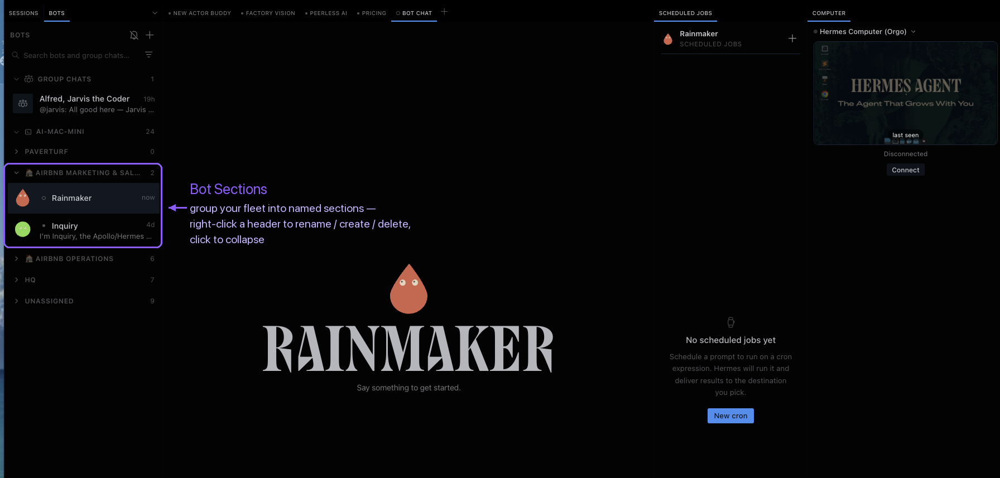

<div align="center">

# Hermes Bot Kit

**The Grok Bot experience for your Hermes fleet.**

Texting-style chat bubbles + a live window into your bots' computers.

[](https://github.com/NousResearch/hermes-agent)
[](#install)
[](https://github.com/thomasbek3/hermes-bot-kit/stargazers)
[](https://github.com/thomasbek3/hermes-bot-kit/commits/master)
[](LICENSE)

[](#whats-in-the-kit)
[](#requirements)
[](#requirements)
[](#install)
[](https://github.com/thomasbek3/hermes-bot-kit/pulls)

[](#install)

</div>

---

Your bots already live in Hermes. This kit makes talking to them feel like
texting a person — and lets you look over their shoulder while they work.
Desktop plugins plus an optional agent plugin, one install:

## What's in the kit

| Plugin | What it does |
|---|---|
| 💬 **[Bubble Mode](bubble-mode/)** | The full texting look — **only on each bot's main Bot Chat**: iMessage bubbles, a "..." typing indicator while the bot works, and thinking/tool/timer/background-process noise hidden (approvals and agent-to-agent "Message from X" chips always visible; one palette command brings the work rows back). Work sessions, side tabs, and Sessions view are never touched. Pure CSS, fails safe. |
| 🖥️ **[Computer](computer-viewer/)** | A live remote-desktop pane docked in Hermes — cloud boxes (Orgo, VPS, Docker), spare Macs, Windows PCs, Linux machines, switchable like a KVM for your fleet. **Auto-connects the moment your bot starts using its computer**, so you watch it work. Optional H.264 HD mode, per-bot computer bindings, and an agent plugin that gives your bots **hands** (shell + screenshot/click/type) on their pinned machine. |
| 🗂️ **[Bot Sections](bot-sections/)** | Grok-Bot-style **named sections in the Bots roster**: right-click a header to create, rename (emoji picker under the input), or delete sections; click to collapse (instant, persisted); native-styled menu with hover tooltips. Fresh installs start from one **Unassigned** bucket; layouts live in plugin storage and survive updates. Move bots via the palette (auto-discovered for every bot in your roster). |
| 📱 **[texting-style](texting-style/)** | An **agent plugin** that makes bots *talk* like texting, not just look like it — and **only in Bot Mode chats**: short replies, mirrors your length, no walls of text, "on it" then the result. Regular Sessions stay stock. Per-profile install, one editable doctrine string. |

<p align="center">
  
</p>
<p align="center"><em>The kit in one screen: iMessage-style Bot Chat, named roster sections, and the live Computer pane.</em></p>


## Install

One command, the desktop plugins (idempotent, no sudo, agents can run it unattended):

```bash
curl -fsSL https://raw.githubusercontent.com/thomasbek3/hermes-bot-kit/master/install.sh | bash
```

Then in Hermes Desktop: **⌘⇧P → Reload plugins** (or restart the app).

- Bubble Mode is on immediately; toggle with **⌘⇧P → Bubble Mode: toggle**.
- Bot Sections is on immediately in the Bots roster; toggle with
  **⌘⇧P → Bot Sections: toggle**. Cycle a bot with
  **⌘⇧P → `Bot Sections: cycle <bot>`**.
- The Computer pane: enable **Computer** in **Settings → Plugins**, then add a
  computer — see the [computer-viewer README](computer-viewer/README.md) for
  connecting cloud boxes, spare Macs/PCs, HD mode, and giving bots hands.

Want just one plugin? `KIT_SKIP_BUBBLES=1`, `KIT_SKIP_COMPUTER=1`, or
`KIT_SKIP_SECTIONS=1` in front of the command, or use each plugin's own
install instructions.

**texting-style** is an *agent* plugin (it changes how bots write, per Hermes
profile), so it has its own one-liner:

```bash
curl -fsSL https://raw.githubusercontent.com/thomasbek3/hermes-bot-kit/master/texting-style/install.sh | bash
```

**Installing via an AI agent?** Point it at [AGENTS.md](AGENTS.md) — exact
unattended install, verify, and uninstall steps, plus the footguns. (Most
coding agents read that file automatically.)

## Requirements

- **Hermes Desktop ≥ 0.20.5**, verified through **v0.20.6** (2026.8.27,
  including the Bot Mode redesign) — earlier builds pre-date the pane shell
  the plugins target.
- The desktop plugins are single-file disk plugins: no build step, no core
  patches, hot-reloadable, and they fail safe (if a Hermes update renames
  internal hooks, they render stock instead of breaking).

## Repository layout

```
install.sh          one-command installer for the desktop plugins
bubble-mode/        Bubble Mode: plugin, installer, docs
bot-sections/       Bot Sections: plugin, docs
texting-style/      agent plugin: SMS-register reply style, per profile
computer-viewer/    Computer: plugin, host connect scripts, HD agent,
                    orgo-computer agent plugin, orgo-term / orgo-hands, docs
connect-*.sh/.ps1   compatibility shims (old one-liners keep working)
hiperf-*.sh/.ps1    compatibility shims (same)
SECURITY.md         security policy (VNC/networking guidance lives in the
                    computer-viewer README)
```

## Formerly `hermes-computer-viewer`

This repo was renamed on 2026-08-27 and absorbed
`hermes-bubble-mode` (now archived, history preserved under `bubble-mode/`).
GitHub redirects all old repo links, and the root shim scripts keep every
previously published `curl … | bash` / `irm … | iex` one-liner working.

## Fine print

Independent community project. Not built by, endorsed by, or affiliated with
Nous Research, xAI, Orgo, or Tailscale. "Grok" and "Grok Bot" are trademarks
of their respective owner — this kit simply chases the same feel for Hermes.
Parts of the agent plugin are adapted from
[Korgo Bot](https://github.com/nickvasilescu/korgo-bot) (MIT) — see
[computer-viewer/NOTICE.md](computer-viewer/NOTICE.md).

MIT — see [LICENSE](LICENSE).
