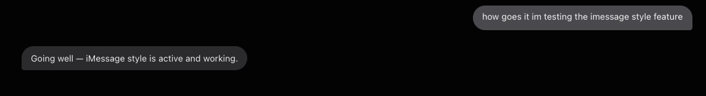

# Bubble Mode for Hermes Desktop

> Part of [**Hermes Bot Kit**](../README.md) — install both desktop plugins
> with one command from the kit root. Everything below also works standalone.

The full iMessage texting look — **only on each bot's canonical Bot Chat**
(the main conversation you get by tapping a bot in Bot Mode). Everything else
— Sessions view, long-form side tabs, group rooms, new drafts — stays
exactly as it is.

On the Bot Chat tab you get:

- **Bubbles.** Your messages light gray on the right, the bot's dark gray on
  the left (Grok-Bot palette). Cards, code blocks, and images keep stock
  chrome; mixed text+code replies split into text bubbles around the cards.
- **Quiet chat.** Thinking disclosures, reasoning text, activity rows, tool
  blocks, per-reply timer chips ("3s"), and background-process notifications
  are hidden. Approvals and agent-to-agent chips ("Message from X") always
  stay visible. Bring the work rows back any time with
  **⌘⇧P → Bubble Mode: toggle work rows** (persists).
- **The composer is never touched.** The 0.20.6 redesign moved the input bar
  into the message structure; anything you can type into is exempt from
  bubble styling by rule.
- **Typing indicator.** While the bot thinks or works, an iMessage-style
  "..." pill with pulsing dots shows where the reply will land.

<p align="center">
  
</p>

## Install (one command — agents can run this unattended)

```bash
curl -fsSL https://raw.githubusercontent.com/thomasbek3/hermes-bot-kit/master/bubble-mode/install.sh | bash
```

Then in Hermes Desktop: **⌘⇧P → Reload plugins** (or restart the app). Done —
every bot's Bot Chat gets the look, including bots you add later. The script
is idempotent, needs no sudo, prompts for nothing, verifies what it
downloaded, and backs up any existing copy before overwriting.

Manual install (equivalent):

```
mkdir -p ~/.hermes/desktop-plugins/bubble-mode
cp plugin.js ~/.hermes/desktop-plugins/bubble-mode/plugin.js
```

The folder must be named `bubble-mode` (it must match the plugin id).

Palette commands (both persist across restarts):

| Command | Effect |
|---|---|
| **Bubble Mode: toggle** | Whole plugin on/off. |
| **Bubble Mode: toggle work rows** | Show/hide thinking, tool, and timer rows inside Bot Chat. |

## Highlights

- **Bot Chat only.** Detection reconstructs "the canonical Bot Chat owns the
  screen" from public SDK signals, DOM stamps, and the selected tab's
  "Bot Chat" title — the same gate Hermes core uses agent-side. Sessions
  chats, Bot Mode side tabs, group rooms, and the Bots home screen are never
  styled.
- **Survives caption scrambles.** A serve-process restart under an open Bot
  Chat can make the desktop re-bind the tab and lose its "Bot Chat" caption
  (stock Hermes bug). Any tab once seen labeled "Bot Chat" is remembered per
  install, so the styling holds even when the caption is wrong.
- **Everything works, only looks change.** Pure CSS plus body-class toggles.
  No core patches, no React wrapping, no network calls, read-only SDK use.
  Streaming, editing, reactions, cards, approvals — all untouched.
- **Fleet-proof.** It skins the Bot Chat surface, not individual agents, so
  every current and future bot gets the look with zero per-agent setup.
- **Fails safe.** If a Hermes update renames the hooks it latches onto,
  bubbles silently stop applying and chats render stock. Nothing breaks.

Pairs with the kit's [texting-style](../texting-style/) agent plugin, which
makes the bot *write* like a texter in the same chats this plugin makes
*look* like texting.

> **Known issues & design notes:** [docs/KNOWN-ISSUES.md](docs/KNOWN-ISSUES.md).
> Full DOM/SDK research behind the detection logic: [docs/BUILD-NOTES.md](docs/BUILD-NOTES.md).

## Compatibility & upstream state

- **Built and verified against Hermes Desktop v0.20.5 AND v0.20.6 (macOS, 2026-08)** — 2.0.0 carries dual detection: the 0.20.5 tab-strip path and the 0.20.6 Bot Mode redesign path (workspace-hosted chat, gated on the Scheduled Jobs tile + transcript visibility).
  Also verified on a build carrying the pending upstream pane fixes
  ([hermes-agent#95956](https://github.com/NousResearch/hermes-agent/pull/95956),
  [hermes-agent#95352](https://github.com/NousResearch/hermes-agent/pull/95352))
  — the plugin does not depend on either; stock and patched builds behave the
  same.
- Upstream has open PRs for an **app-wide** bubble layout
  ([#71961](https://github.com/NousResearch/hermes-agent/pull/71961),
  [#41402](https://github.com/NousResearch/hermes-agent/pull/41402)), both
  stalled. They're all-or-nothing: bubbles everywhere or nowhere. This plugin
  exists because the bot's main thread should feel like texting while work
  sessions keep the full-width transcript. If one of those PRs merges, the
  two coexist.
- The hooks this plugin reads (`data-slot` message attributes, the
  `hermes-bots:pane` id, chat-surface stamps, session-tile tab labels) are
  stable in v0.20.x but not a public API.
  [docs/KNOWN-ISSUES.md](docs/KNOWN-ISSUES.md) documents the failure mode
  (silent no-op) and the re-tune path;
  [docs/BUILD-NOTES.md](docs/BUILD-NOTES.md) maps every hook to its location
  in the Hermes source so future maintenance is a find-and-replace, not a
  rediscovery.

## Colors

Tuned for the dark theme, sampled from Grok Bot:

| Surface | Color |
|---|---|
| Your bubble (right) | `#4a4a4e`, ink `#f2f2f3` |
| Agent bubble (left) | `#2b2b2e`, ink `#e8e8ea` |
| Radius | `18px`, `4px` tail on the inner corner |
| Typing pill | `#2b2b2e`, 6px dots, 16px radius |

Want different colors? They live in one obvious `CSS` block at the top of
`plugin.js` — edit the hex values and reload plugins.

## Repository layout

```
plugin.js            the entire plugin (single ESM file, CSS + detection)
install.sh           one-command installer (curl-pipe friendly, idempotent)
docs/SPEC.md         the original build spec
docs/BUILD-NOTES.md  DOM/SDK research: every selector, why, and where it
                     lives in the Hermes source
docs/KNOWN-ISSUES.md design decisions, environment notes, update risk
CHANGELOG.md         version history
```

Plugin id: `bubble-mode` (folder name must match).

## How it detects the Bot Chat

A disk plugin can't import the bundled hermes-bots plugin's internal state,
so Bubble Mode reconstructs the question from public signals:
`host.paneVisibility('hermes-bots:pane')`, the Bots home / group-chat tab
state, and — since 1.2.0 — the selected session tab's label: only the tab
titled **"Bot Chat"** (the desktop's canonical per-bot conversation, the same
title Hermes core gates on in `tools/bot_mode_probe.py`) gets the look.
Since 1.4.0 the plugin also remembers tab ids it has seen correctly labeled,
so a desktop tab-caption scramble can't turn the styling off. The full
derivation — including the signals that looked tempting and were rejected —
is in [docs/BUILD-NOTES.md](docs/BUILD-NOTES.md).

## License

MIT
